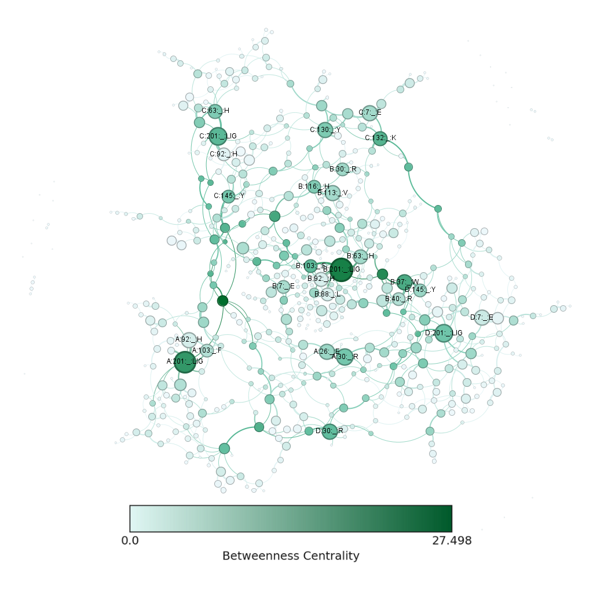
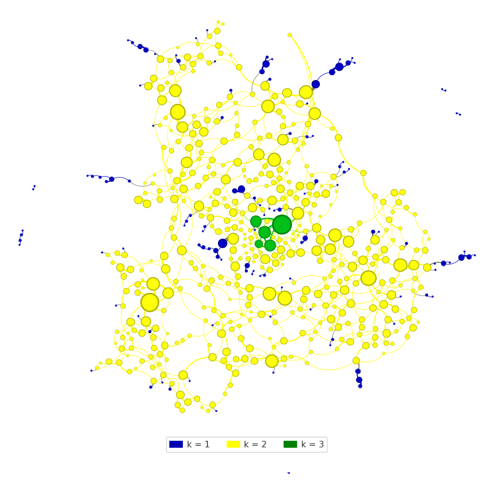

# Análise de Estruturas Complexas com Gephi e NetworkX

## **📋 Informações Acadêmicas**  
| Campo               | Detalhe                                                                |
|---------------------|------------------------------------------------------------------------|
| **Universidade**    | *Universidade Federal do Rio Grande do Norte - UFRN*                   |
| **Departamento**    | *Departamento de Engenharia da Computação e Automação - DCA*           |
| **Disciplina**      | *DCA4013 - Grafos e Estruturas Complexas*                              |
| **Aluno**           | *Vinícius Silva do Carmo*                                              |

---

## **🛠️ Tecnologias Utilizadas**
-   
-   
-   
- 
- 
- 
- 

---

## **📁 Organização do Projeto**

| Pasta/Arquivo            | Descrição                                                       |
|--------------------------|-----------------------------------------------------------------|
| `imagens/`               | Contém as visualizações geradas no Gephi.                       |
| `network/`               | Rede exportada com Plugin SigmaExporter.                        |
| `final_netwokr.gexf`     | Rede exportada para análise no Gephi.                           |

---

## **📊 Requisitos Atendidos**

### ✅ Requisito 1 – Centralidade e Visualização
- **Tamanho do nó:** proporcional ao grau.
- **Cor do nó:** baseada na **Betweenness Centrality**.
- **Layout:** ForceAtlas2.

Para este requisito, foi criada uma visualização da rede no Gephi com ênfase na centralidade de intermediação (**Betweenness Centrality**):

- **Construção do grafo:** Os dados foram processados em Python com NetworkX a partir dos arquivos `GraphTest_nodes.txt` e `GraphTest_edges.txt`, e exportados em formato `.gexf`.
- **Importação e análise no Gephi:** O arquivo `.gexf` foi importado no Gephi, onde a métrica de Betweenness Centrality foi calculada para todos os nós.
- **Visualização aprimorada:**
    - **Cores dos nós:** Gradiente de verde, onde verde claro representa baixa centralidade e verde escuro destaca os nós com alta centralidade (nós-pontes).
    - **Tamanho dos nós:** Proporcional ao grau (degree) de cada vértice, facilitando a identificação dos nós mais conectados.
    - **Layout:** Aplicação do ForceAtlas2, que evidencia agrupamentos e estruturas internas da rede.
    - **Legendas e resolução:** A imagem foi exportada em alta resolução, acompanhada de uma legenda visual clara, facilitando a interpretação da escala de centralidade e dos tamanhos dos nós.

Essa abordagem proporciona uma visualização intuitiva, permitindo identificar rapidamente os nós mais influentes e as principais conexões da rede.

### ✅ Requisito 2 – K-Core e K-Shell
- **Visualização com cores por k-core** (azul: k=1, amarelo: k=2, verde: k=3).

Para este requisito, o objetivo foi evidenciar as diferentes camadas estruturais da rede por meio da decomposição em k-core, facilitando a análise visual dos agrupamentos internos:

- **Processo no Gephi:** Utilizou-se o filtro *Topology > K-Core* para segmentar a rede em subgrafos de acordo com o valor de *k*.
- **Destaque visual dos k-cores:**
    - **k = 1 (nós periféricos):** representados em azul.
    - **k = 2 (nós intermediários):** representados em amarelo.
    - **k = 3 (núcleo mais conectado):** representados em verde.
- **Tamanho dos nós:** manteve-se proporcional ao grau, permitindo identificar rapidamente os vértices mais conectados em cada camada.
- **Aprimoramento visual:** 
    - O layout ForceAtlas2 foi aplicado para realçar a separação entre as camadas.
    - A paleta de cores foi escolhida para garantir contraste e fácil distinção entre os diferentes k-shells.
    - A imagem final foi exportada em alta resolução, acompanhada de uma legenda clara que associa cada cor ao respectivo valor de *k*.

Essa visualização aprimorada permite identificar de forma intuitiva as regiões periféricas, intermediárias e o núcleo da rede, facilitando a compreensão das estruturas internas e dos papéis dos nós em cada camada.

### ✅ Requisito 3 – Comunidades e Métrica Livre
- **Cores dos nós:** por detecção de comunidades (modularity class).
- **Tamanho dos nós:** baseado em grau.
- **Layout:** ForceAtlas2.

Neste requisito, a rede foi analisada com foco na detecção de comunidades (clusters) e em uma métrica livre para destacar a influência dos nós:

- **Detecção de comunidades:** O algoritmo de Modularidade (Louvain method) foi aplicado no Gephi para identificar grupos de nós densamente conectados.
- **Cores dos nós:** Cada comunidade recebeu uma cor distinta, definida pela Modularity Class, facilitando a visualização dos agrupamentos.
- **Tamanho dos nós:** Dimensionado proporcionalmente ao valor do grau, destacando visualmente os nós mais influentes em cada comunidade.
- **Layout:** O ForceAtlas2 foi utilizado para separar e evidenciar os clusters, tornando a estrutura da rede mais clara.
- **Aprimoramento visual:** 
    - As cores das comunidades foram selecionadas para garantir contraste e fácil distinção entre os grupos.
    - A escala de tamanhos dos nós foi ajustada para realçar os vértices de maior centralidade sem comprometer a legibilidade.

Essa abordagem proporciona uma visualização intuitiva, permitindo identificar rapidamente as comunidades, os nós mais influentes e as conexões-chave dentro da rede.

- **Projeto Final Network:** [https://oviniciusdocarmo.github.io/AEDII/PROJETOFINAL/network/](https://oviniciusdocarmo.github.io/AEDII/PROJETOFINAL/network/)

- **Apresentação:** [https://youtu.be/Xh0wWoSKuHY](https://youtu.be/Xh0wWoSKuHY)