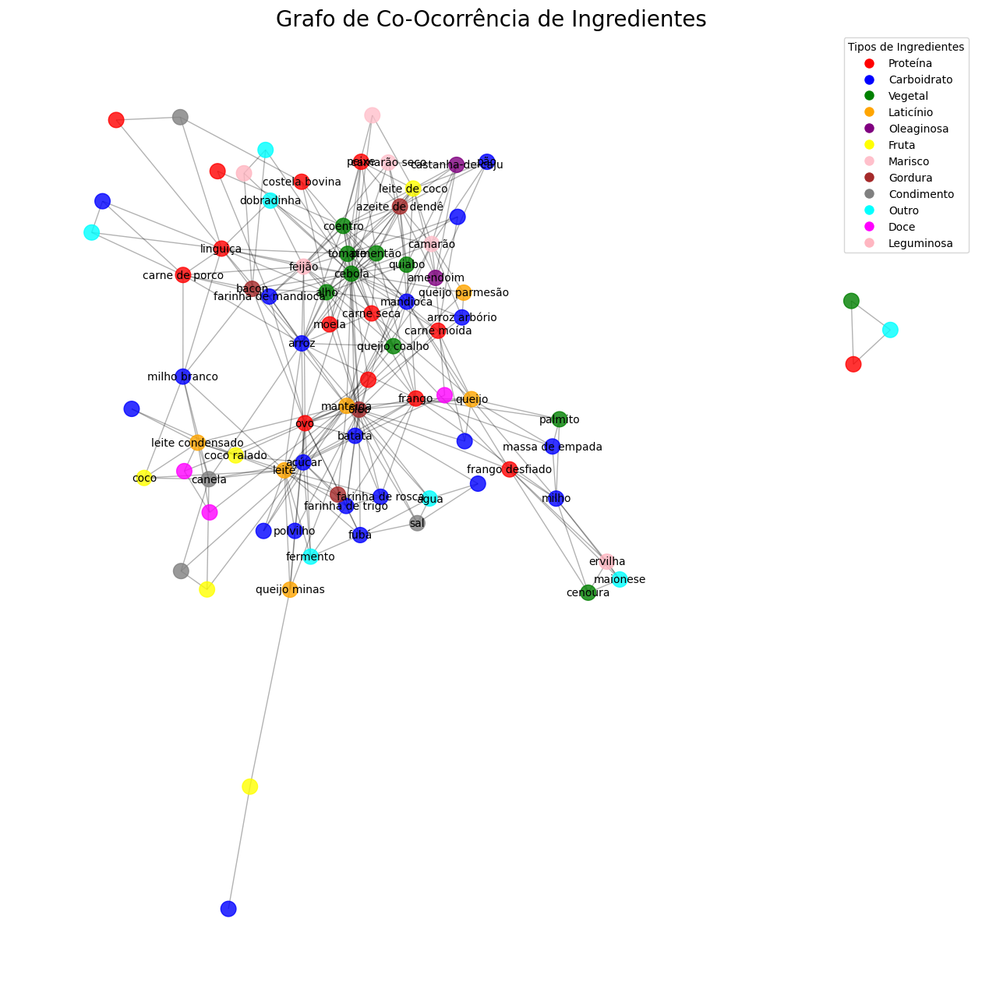
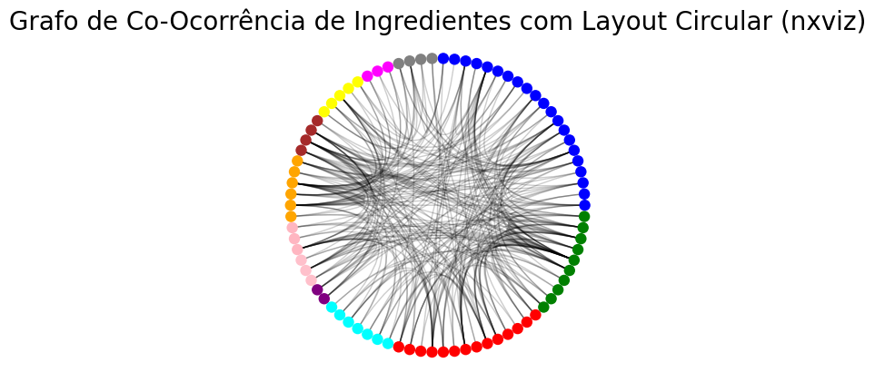

# Análise de Co-Ocorrência de Ingredientes da Culinária Brasileira

## **📋 Informações Acadêmicas**  
| Campo               | Detalhe                              |
|---------------------|--------------------------------------------------------------|
| **Universidade**    | *Universidade Federal do Rio Grande do Norte - UFRN*         |
| **Departamento**    | *Departamento de Engenharia da Computação e Automação - DCA* |
| **Disciplina**      | *DCA3702 - ALGORITMOS E ESTRUTURAS DE DADOS II*              |
| **Aluno(a)**        | *Vinícius Silva do Carmo*                                    |

---

## **🛠️ Tecnologias Utilizadas**  
-   
-   
-   
- 

---

## **🚀 Como Executar?**  
1. Clone o repositório:  
   ```bash
   git clone https://github.com/oviniciusdocarmo/AEDII
   ```
2. Instale as dependências:  
   ```bash
   pip install -r requirements.txt
   ```
3. Abra os notebooks no Jupyter:  
   ```bash
   jupyter notebook
   ```

---

## 🎯 Descrição da Tarefa
Este projeto teve como objetivo analisar as co-ocorrências de ingredientes em receitas brasileiras populares. Utilizando o pacote NetworkX, foi construído um grafo onde os ingredientes são representados como nós e suas co-ocorrências como arestas. 

O trabalho envolveu:
- Leitura dos dados de ingredientes e seus tipos.
- Construção do grafo de co-ocorrência.
- Cálculo do coeficiente de assortatividade por tipo de ingrediente.
- Visualização do grafo com agrupamento por tipo e cores distintas.
- Discussão dos principais resultados encontrados.

📹 **Link para o vídeo de apresentação**: [Vídeo](https://drive.google.com/file/d/1glXQ2DRFokn_dvYOySJ6QI_9rZBYHX7R/view?usp=sharing)

---

## 🧠 Discussão dos Principais Achados

O coeficiente de assortatividade obtido foi de aproximadamente **-0,0309**. Esse valor, ligeiramente negativo e próximo de zero, sugere que a combinação entre ingredientes de diferentes tipos ocorre de forma quase aleatória, mas com uma pequena tendência à **heterofilia** (mistura de tipos diferentes).

Entre as hipóteses para esse resultado destacam-se:
- **Diversidade alimentar no Brasil**: A culinária brasileira é extremamente diversa, misturando influências indígenas, africanas e europeias, o que incentiva combinações variadas de ingredientes.
- **Reutilização de ingredientes comuns**: Ingredientes como cebola, alho, arroz e óleo aparecem em diversas receitas, promovendo co-ocorrências entre diferentes categorias.
- **Equilíbrio nutricional**: Muitas receitas tradicionais combinam proteínas, carboidratos e vegetais em um único prato, promovendo interações entre tipos distintos.
- **Flexibilidade culinária**: A cozinha brasileira é conhecida por adaptar receitas, permitindo trocas e misturas de ingredientes de categorias variadas.

Esses fatores explicam o comportamento observado no grafo e reforçam a riqueza e adaptabilidade da culinária brasileira.

---

## 📸 Visualização do Grafo




---

## **📌 Referências**  
- **Livro Completo**: [Coscia, Michele. The Atlas for the Aspiring Network Scientist](https://www.networkatlas.eu/)


