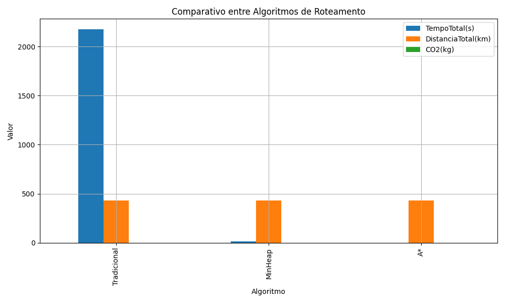

# Explorando o Algoritmo A*

## **📋 Informações Acadêmicas**  
| Campo               | Detalhe                              |
|---------------------|--------------------------------------------------------------|
| **Universidade**    | *Universidade Federal do Rio Grande do Norte - UFRN*         |
| **Departamento**    | *Departamento de Engenharia da Computação e Automação - DCA* |
| **Disciplina**      | *DCA3702 - ALGORITMOS E ESTRUTURAS DE DADOS II*              |
| **Aluno(a)**        | *Vinícius Silva do Carmo*                                    |

---

## **🛠️ Tecnologias Utilizadas**  
-   
-   
-   
-   
- 

---

## **🚀 Como Executar?**  
1. Clone o repositório:  
   ```bash
   git clone https://github.com/oviniciusdocarmo/AEDII
   ```
2. Instale as dependências:  
   ```bash
   pip install -r requirements.txt
   ```
3. Abra os notebooks no Jupyter:  
   ```bash
   jupyter notebook
   ```

---

## 📍 Contexto

- **Cidade:** Natal/RN
- **Pontos de Coleta:** 65 (divididos em 10 clusters)
- **Estação Central:** Centro de Controle de Zoonoses
- **Objetivo:** Criar uma estratégia para mapeamento das rotas utilizando os algoritmos: A*, Dijkstra e Dijkstra + min-heap para o cálculo das rotas (networkx, osmnx)

---

## 📊 Coordenadas utilizadas

|      Lon |      Lat | Neighborhood        | District   |
|---------:|---------:|:--------------------|:-----------|
| -5.79085 | -35.2098 | Alecrim             | East       |
| -5.79629 | -35.1967 | Tirol               | East       |
| -5.78826 | -35.1903 | Areia Preta         | East       |
| -5.78053 | -35.2041 | Ribeira             | East       |
| -5.76782 | -35.2007 | Santos Reis         | East       |
| -5.74896 | -35.2058 | Redinha             | North      |
| -5.74266 | -35.2163 | Redinha             | North      |
| -5.74848 | -35.2281 | Redinha             | North      |
| -5.75442 | -35.2372 | Potengi             | North      |
| -5.75922 | -35.2484 | Potengi             | North      |
| -5.76046 | -35.2548 | Potengi             | North      |
| -5.75423 | -35.2641 | N. S. Apresentação  | North      |
| -5.74453 | -35.2693 | N. S. Apresentação  | North      |
| -5.73805 | -35.2634 | Lagoa Azul          | North      |
| -5.74686 | -35.2544 | Potengi             | North      |
| -5.74781 | -35.2407 | Pajuçara            | North      |
| -5.73957 | -35.2375 | Pajuçara            | North      |
| -5.73332 | -35.2517 | Lagoa Azul          | North      |
| -5.72441 | -35.2654 | Lagoa Azul          | North      |
| -5.72614 | -35.2751 | Lagoa Azul          | North      |
| -5.73413 | -35.285  | N. S. Apresentação  | North      |
| -5.74028 | -35.2845 | N. S. Apresentação  | North      |
| -5.74917 | -35.2798 | N. S. Apresentação  | North      |
| -5.75855 | -35.2811 | N. S. Apresentação  | North      |
| -5.76206 | -35.2744 | N. S. Apresentação  | North      |
| -5.76551 | -35.2615 | Igapó               | North      |
| -5.79886 | -35.2368 | Quintas             | West       |
| -5.81158 | -35.2363 | Bom Pastor          | West       |
| -5.81979 | -35.2302 | N. Sra. Nazaré      | West       |
| -5.81277 | -35.2226 | Lagoa Nova          | South      |
| -5.8049  | -35.2259 | Alecrim             | East       |
| -5.80349 | -35.2172 | Alecrim             | East       |
| -5.82263 | -35.2083 | Lagoa Nova          | South      |
| -5.81628 | -35.199  | Nova Descoberta     | South      |
| -5.80548 | -35.221  | Alecrim             | East       |
| -5.80359 | -35.2442 | Bom Pastor          | West       |
| -5.81353 | -35.248  | Bom Pastor          | West       |
| -5.81818 | -35.2434 | Felipe Camarão      | West       |
| -5.82771 | -35.2411 | Cidade da Esperança | West       |
| -5.8298  | -35.2518 | Felipe Camarão      | West       |
| -5.8285  | -35.244  | Cidade Nova         | West       |
| -5.83561 | -35.2298 | Candelária          | South      |
| -5.83431 | -35.2134 | Candelária          | South      |
| -5.84094 | -35.2036 | Lagoa Nova          | South      |
| -5.85826 | -35.2077 | Neópolis            | South      |
| -5.86889 | -35.1966 | Capim Macio         | South      |
| -5.88083 | -35.1929 | Ponta Negra         | South      |
| -5.88255 | -35.1746 | Ponta Negra         | South      |
| -5.89182 | -35.1705 | Ponta Negra         | South      |
| -5.87688 | -35.1851 | Ponta Negra         | South      |
| -5.85675 | -35.2175 | Candelária          | South      |
| -5.85515 | -35.225  | Candelária          | South      |
| -5.85142 | -35.2418 | Pitimbu             | South      |
| -5.8461  | -35.2553 | Planalto            | West       |
| -5.85386 | -35.2617 | Planalto            | West       |
| -5.8541  | -35.2503 | Planalto            | West       |
| -5.83922 | -35.249  | Guarapes            | West       |
| -5.83486 | -35.2636 | Guarapes            | West       |
| -5.84399 | -35.2691 | Guarapes            | West       |
| -5.83816 | -35.279  | Guarapes            | West       |
| -5.82743 | -35.2778 | Guarapes            | West       |
| -5.82068 | -35.2659 | Felipe Camarão      | West       |
| -5.73878 | -35.2706 | N. S. Apresentação  | North      |
| -5.72615 | -35.2503 | Lagoa Azul          | North      |
| -5.72833 | -35.2403 | Pajuçara            | North      |

> O arquivo pode ser encontrado em:
> [`dados/centroid_filtered.csv`](dados/centroid_filtered.csv)

---

## 💨 Emissões computacionais monitoradas com CodeCarbon

| timestamp           | project_name   | run_id                               | experiment_id                        |   duration |   emissions |   emissions_rate |   cpu_power |   gpu_power |   ram_power |   cpu_energy |   gpu_energy |   ram_energy |   energy_consumed | country_name   | country_iso_code   | region              |   cloud_provider |   cloud_region | os                        | python_version   | codecarbon_version   |   cpu_count | cpu_model                              |   gpu_count |   gpu_model |   longitude |   latitude |   ram_total_size | tracking_mode   | on_cloud   |   pue |
|:--------------------|:---------------|:-------------------------------------|:-------------------------------------|-----------:|------------:|-----------------:|------------:|------------:|------------:|-------------:|-------------:|-------------:|------------------:|:---------------|:-------------------|:--------------------|-----------------:|---------------:|:--------------------------|:-----------------|:---------------------|------------:|:---------------------------------------|------------:|------------:|------------:|-----------:|-----------------:|:----------------|:-----------|------:|
| 2025-06-06T18:34:39 | Tradicional    | c8d18449-73f7-4328-b3e3-80100de0a3cd | 5b0fa12a-3dd7-45bb-9766-cc326314d9f1 |    2172.68 |   0.0230424 |      1.06055e-05 |         390 |           0 |          10 |     0.228463 |            0 |   0.00583169 |          0.234295 | Brazil         | BRA                | rio grande do norte |              nan |            nan | Windows-11-10.0.26100-SP0 | 3.12.2           | 3.0.1                |          12 | AMD Ryzen 5 5600G with Radeon Graphics |         nan |         nan |    -35.2235 |    -5.8111 |          15.3526 | machine         | N          |     1 |

> O arquivo pode ser encontrado em:
> [`emissions/tradicional.csv`](emissions/tradicional.csv)

| timestamp           | project_name   | run_id                               | experiment_id                        |   duration |   emissions |   emissions_rate |   cpu_power |   gpu_power |   ram_power |   cpu_energy |   gpu_energy |   ram_energy |   energy_consumed | country_name   | country_iso_code   | region              |   cloud_provider |   cloud_region | os                        | python_version   | codecarbon_version   |   cpu_count | cpu_model                              |   gpu_count |   gpu_model |   longitude |   latitude |   ram_total_size | tracking_mode   | on_cloud   |   pue |
|:--------------------|:---------------|:-------------------------------------|:-------------------------------------|-----------:|------------:|-----------------:|------------:|------------:|------------:|-------------:|-------------:|-------------:|------------------:|:---------------|:-------------------|:--------------------|-----------------:|---------------:|:--------------------------|:-----------------|:---------------------|------------:|:---------------------------------------|------------:|------------:|------------:|-----------:|-----------------:|:----------------|:-----------|------:|
| 2025-06-06T20:11:35 | MinHeap        | 77da3687-0f38-43c9-b92a-b97f9762129a | 5b0fa12a-3dd7-45bb-9766-cc326314d9f1 |     12.236 | 0.000133691 |       1.0926e-05 |         390 |           0 |          10 |   0.00132539 |            0 |  3.39732e-05 |        0.00135937 | Brazil         | BRA                | rio grande do norte |              nan |            nan | Windows-11-10.0.26100-SP0 | 3.12.2           | 3.0.1                |          12 | AMD Ryzen 5 5600G with Radeon Graphics |         nan |         nan |    -35.2235 |    -5.8111 |          15.3526 | machine         | N          |     1 |

> O arquivo pode ser encontrado em:
> [`emissions/minheap.csv`](emissions/minheap.csv)

| timestamp           | project_name   | run_id                               | experiment_id                        |   duration |   emissions |   emissions_rate |   cpu_power |   gpu_power |   ram_power |   cpu_energy |   gpu_energy |   ram_energy |   energy_consumed | country_name   | country_iso_code   | region   |   cloud_provider |   cloud_region | os                        | python_version   | codecarbon_version   |   cpu_count | cpu_model                              |   gpu_count |   gpu_model |   longitude |   latitude |   ram_total_size | tracking_mode   | on_cloud   |   pue |
|:--------------------|:---------------|:-------------------------------------|:-------------------------------------|-----------:|------------:|-----------------:|------------:|------------:|------------:|-------------:|-------------:|-------------:|------------------:|:---------------|:-------------------|:---------|-----------------:|---------------:|:--------------------------|:-----------------|:---------------------|------------:|:---------------------------------------|------------:|------------:|------------:|-----------:|-----------------:|:----------------|:-----------|------:|
| 2025-06-06T20:11:44 | A*             | 4192b6a2-b5ad-47ec-a83e-b90adffec2e9 | 5b0fa12a-3dd7-45bb-9766-cc326314d9f1 |    1.20686 | 3.18492e-07 |      2.63901e-07 |         390 |           0 |          10 |  0.000130639 |            0 |  3.33783e-06 |       0.000133977 | Canada         | CAN                | quebec   |              nan |            nan | Windows-11-10.0.26100-SP0 | 3.12.2           | 3.0.1                |          12 | AMD Ryzen 5 5600G with Radeon Graphics |         nan |         nan |       -71.2 |       46.8 |          15.3526 | machine         | N          |     1 |

> O arquivo pode ser encontrado em:
> [`emissions/astar.csv`](emissions/astar.csv)

---

## 📊 Resultados

| Algoritmo   |   TempoTotal(s) |   DistanciaTotal(km) |   CO2(kg) |
|:------------|----------------:|---------------------:|----------:|
| Tradicional |         2172.67 |               433.66 |  0.023042 |
| MinHeap     |           12.22 |               433.66 |  0.000134 |
| A*          |            1.19 |               433.66 |  0.000000 |

> A tabela acima é gerada automaticamente no final da execução e pode ser encontrada em:
> [`resultados/resultados_comparacao.csv`](resultados/resultados_comparacao.csv)

---

## 📈 Gráfico Comparativo




